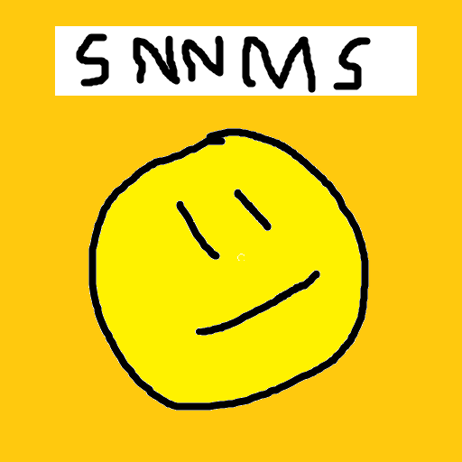

# SimpleNotNotchianMinecraftServer

SimpleNotNotchianMinecraftServer

<!-- PROJECT SHIELDS -->

[![Contributors][contributors-shield]][contributors-url]
[![Forks][forks-shield]][forks-url]
[![Stargazers][stars-shield]][stars-url]
[![Issues][issues-shield]][issues-url]
[![MIT License][license-shield]][license-url]

<!-- PROJECT LOGO -->
<br />

<p align="center">
  <a href="https://github.com/shaojintian/Best_README_template/">
    
  </a>

  <h3 align="center">SimpleNotNotchianMinecraftServer</h3>
  <p align="center">
    一个"从0开发的"Minecraft Java版服务器,使用 C++ 编写
    <br />
    <a href="https://github.com/Jrojro728/SimpleNotNotchianMinecraftServer"><strong>探索本项目的文档 »</strong></a>
    <br />
    <br />
    <a href="https://github.com/Jrojro728/SimpleNotNotchianMinecraftServer/releases">查看Demo</a>
    ·
    <a href="https://github.com/Jrojro728/SimpleNotNotchianMinecraftServer/issues">报告Bug</a>
    ·
    <a href="https://github.com/Jrojro728/SimpleNotNotchianMinecraftServer/issues">提出新特性</a>
  </p>

</p>

 
## 目录

- [上手指南](#上手指南)
  - [开发前的配置要求](#开发前的配置要求)
  - [安装步骤](#安装步骤)
- [文件目录说明](#文件目录说明)
- [开发的架构](#开发的架构)
- [部署](#部署)
- [使用到的框架](#使用到的框架)
- [贡献者](#贡献者)
  - [如何参与开源项目](#如何参与开源项目)
- [版本控制](#版本控制)
- [作者](#作者)
- [鸣谢](#鸣谢)

### 上手指南

为什么要这一段，明明已经够简单了(

1. 使用vs2022构建此项目
2. 无了

###### 开发前的配置要求

1. 安装 vcpkg 和 Visual Studio 2022
2. 使用 vcpkg 安装 jsoncpp, openssl, boost-asio(都是64位版本)

###### **安装步骤**

1. Clone这个项目

```sh
git clone https://github.com/Jrojro728/SimpleNotNotchianMinecraftServer.git
```
2. 构建

### 文件目录说明

全在根目录

### 开发的架构 

暂无

### 部署

暂无

### 使用到的框架

- [jsoncpp](https://github.com/open-source-parsers/jsoncpp)
- [openssl](https://github.com/openssl/openssl)
- [Boost.Asio](http://boost.org/libs/asio)

### 贡献者

 [Jrojro728](https://github.com/Jrojro728)


#### 如何参与开源项目

贡献使开源社区成为一个学习、激励和创造的绝佳场所。你所作的任何贡献都是**非常感谢**的😘。


1. Fork这个项目
2. 创造一个branch
3. 提交你的修改
4. 开启一个pr

### 版本控制

该项目使用Git进行版本管理。(这不废话吗,github不用git用什么😂)

### 作者

Jrojro728
QQ:3101109252  
Mail:310110252@qq.com

### 版权说明

该项目签署了MIT 授权许可，详情请参阅 [LICENSE.txt](https://github.com/Jrojro728/SimpleNotNotchianMinecraftServer/blob/master/LICENSE.txt)

### 鸣谢

- [wiki.vg](wiki.vg)

<!-- links -->
[your-project-path]:Jrojro728/SimpleNotNotchianMinecraftServer
[contributors-shield]: https://img.shields.io/github/contributors/Jrojro728/SimpleNotNotchianMinecraftServer.svg?style=flat-square
[contributors-url]: https://github.com/Jrojro728/SimpleNotNotchianMinecraftServer/graphs/contributors
[forks-shield]: https://img.shields.io/github/forks/Jrojro728/SimpleNotNotchianMinecraftServer.svg?style=flat-square
[forks-url]: https://github.com/Jrojro728/SimpleNotNotchianMinecraftServer/network/members
[stars-shield]: https://img.shields.io/github/stars/Jrojro728/SimpleNotNotchianMinecraftServer.svg?style=flat-square
[stars-url]: https://github.com/Jrojro728/SimpleNotNotchianMinecraftServer/stargazers
[issues-shield]: https://img.shields.io/github/issues/Jrojro728/SimpleNotNotchianMinecraftServer.svg?style=flat-square
[issues-url]: https://img.shields.io/github/issues/Jrojro728/SimpleNotNotchianMinecraftServer.svg
[license-shield]: https://img.shields.io/github/license/Jrojro728/SimpleNotNotchianMinecraftServer.svg?style=flat-square
[license-url]: https://github.com/Jrojro728/SimpleNotNotchianMinecraftServer/blob/master/LICENSE.txt
